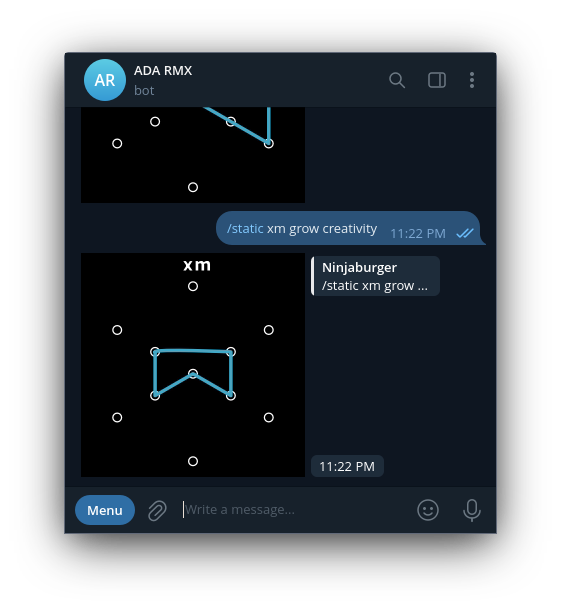
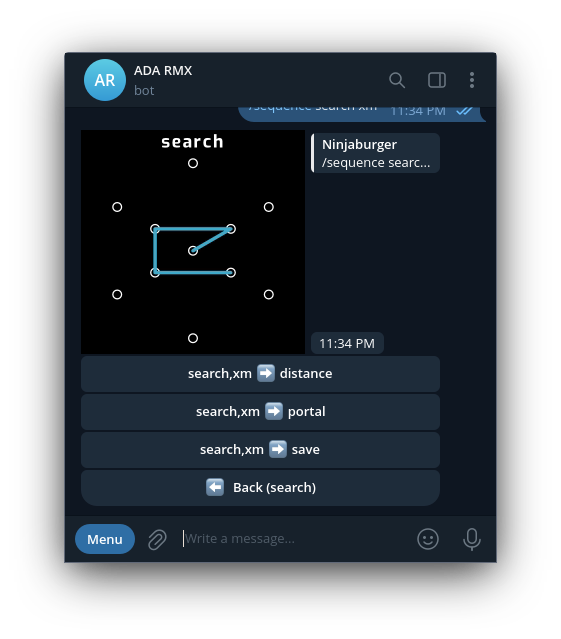
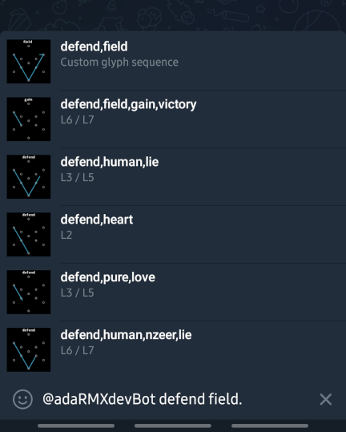
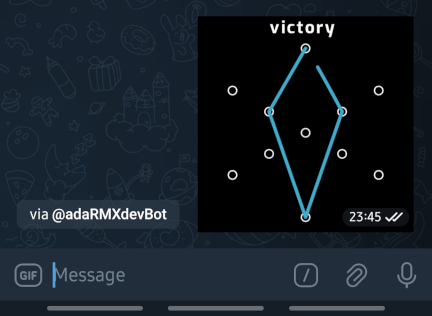
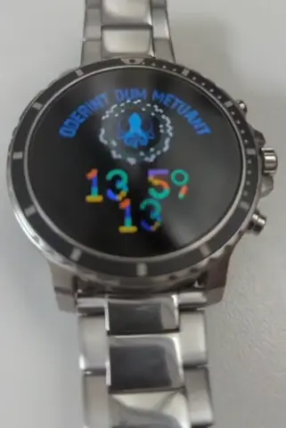

# Ingress Glyph Sticker Bot

A Telegram bot that generates animated stickers of Ingress glyphs. Start a chat with [@adaRMXbot](https://t.me/adaRMXbot) and type in any glyph or sequence to get your sticker.


Since this bot is a learning and practicing tool, you can experiment with any glyph or sequence — even ones not available in the scanner.  You can also create your own custom glyphs! To draw a custom glyph, simply type the sequence of numbered nodes from the calibration grid below, as if you're sketching a line through them:

```
        0
 5              1
    9       6
        a
    8       7
 4              2
        3
```

For example, the glyph `Complex` could also be entered as `8a96` or `69a8`:


Have fun exploring and creating your unique glyphs!

## Features

- Caches users' glyphs for faster responses.
- Adds captions with the glyph name at the top-middle, right above the calibration grid. *As Telegram **does not** support Lottie [text layers](https://core.telegram.org/stickers#animation-requirements), captions are rendered using shape layers to work around this limitation*.
- `/static` command to generate stickers without the connect-the-dots animation.

  

- `/sequence` command to explore sequences using inline keyboards. Type `/sequence initial-glyph-or-partial-sequence` and the bot will generate the glyph sticker with buttons to navigate back and forth through the sequence.

  

- Mentioning or tagging the bot in any chat group will get you the glyphs (or sequence) you queried, plus the top 5 most similar sequences for easy reference. ⚠️ End your query with a **period (.)** so the bot knows you're done typing and can generate your sticker.

  
  

- Corrects misspelled glyphs using string similarity algorithms (when possible).

## Installation

This bot runs as a webhook on Cloudflare Workers, a serverless computing platform that handles everything for you without needing to manage infrastructure. This section covers the basics to get your own Telegram bot up and running on Cloudflare Workers.

1. [Create a new bot](https://core.telegram.org/bots/features#creating-a-new-bot). *Keep the authentication token handy for later*.
2. Set up a [Cloudflare account](https://dash.cloudflare.com/sign-up/workers) if you don't already have one.
3. [Install Wrangler](https://developers.cloudflare.com/workers/wrangler/install-and-update/#install-wrangler) and [log in](https://developers.cloudflare.com/workers/wrangler/commands/#login)  with your Cloudflare account.
4. Open a terminal and run this command to create your Worker project:

    ```bash
    npm create cloudflare@latest new-project-name -- --template https://github.com/ninjaburger/ingress-glyph-sticker-bot
    ```

5. Create a new KV namespace for storage:

    ```bash
    npx wrangler kv namespace create cache
    ```
    ```console
    🌀 Creating namespace with title "new-project-name-cache"
    ✨ Success!
    Add the following to your configuration file in your kv_namespaces array:
    [[kv_namespaces]]
    binding = "cache"
    id = "xxxxxxxxxxxxxxxxxxxxxxxxxxxxxxxx"
    ```

   - Write the initial KV values for `stickerCache` and `glyphSequence` cache objects:

    ```bash
    npx wrangler kv key put stickerCache '{"userQueries":[],"recentUsers":[]}' --namespace-id xxxxxxxxxxxxxxxxxxxxxxxxxxxxxxxx
    npx wrangler kv key put glyphSequence "[]" --namespace-id xxxxxxxxxxxxxxxxxxxxxxxxxxxxxxxx
    ```

    `glyphSequence` will store a `Map<string, string>` where the key is the glyph-sequence and the value is the sticker file_id, like: `[["abandon,fear,defend,future","CAACAgEAA..."],["abandon,fear,together","CAACAgEAA..."]]`.


6. Create a secret variable to store your Telegram authentication token (generated in Step 1)

    ```bash
    npx wrangler secret put TELEGRAM_BOT_TOKEN
    ```
    ```console
    ✔ Enter a secret value: … *************
    🌀 Creating the secret for the Worker "new-project-name"
    ✨ Success! Uploaded secret TELEGRAM_BOT_TOKEN
    ```

7. Review and adjust the `wrangler.toml` [configuration file](#configuration)

8. Deploy your Worker:

    ```bash
    npx wrangler deploy
    ```
    ```console
    Total Upload: 0.19 KiB / gzip: 0.16 KiB
    Worker Startup Time: 1 ms
    Your worker has access to the following bindings:
    - KV Namespaces:
      - cache: xxxxxxxxxxxxxxxxxxxxxxxxxxxxxxxx
    - Vars:
      - MAINTENANCE_CHAT_ID: "REDACTED"
      - LRU_USERLIMIT: 50
      - LRU_QUERYLIMIT: 50
    Uploaded new-project-name (2.57 sec)
    Published new-project-name (3.81 sec)
      https://new-project-name.ninjaburger-at-cloudflare.workers.dev
    Current Deployment ID: xxxxxxxx-xxxx-xxxx-xxxx-xxxxxxxxxxxx
    Current Version ID: xxxxxxxx-xxxx-xxxx-xxxx-xxxxxxxxxxxx
    ```

    *Your Worker URL will look something like https://new-project-name.ninjaburger-at-cloudflare.workers.dev. You'll need this URL for the next step.*

9. Set the [Telegram Webhook](https://core.telegram.org/bots/api#setwebhook) using your Worker URL.

And that's it! Your bot should be up and running. :-)

## Configuration

Update the following settings in your `wrangler.toml` file

```
#:schema node_modules/wrangler/config-schema.json

#your worker name
name = "new-project-name"

main = "src/index.js"
compatibility_date = "2024-08-06"
compatibility_flags = ["nodejs_compat"]

[vars]
# Where to dump stickers generated from Inline Queries (it can be chat group or channel)
MAINTENANCE_CHAT_ID = "YOUR-CHAT-ID"

# How many users to cache
LRU_USERLIMIT = 50

# How many queries (stickers) per user to cache
LRU_QUERYLIMIT = 50

[[kv_namespaces]]
binding = "cache"
id = "xxxxxxxxxxxxxxxxxxxxxxxxxxxxxxxx"
```

## Development

The bot builds [Lottie](https://airbnb.io/lottie) animations from scratch. To customize or generate the Lottie animation JSON data, check out the `buildGlyphSticker` function.

```javascript
import { buildGlyphSticker } from './modules/lottie.mjs';l

const input = 'xm, grow, creativity',
	animated = true,
	showCaption = true;

const lottieData = buildGlyphSticker(input, { animated, showCaption });
console.log(JSON.stringify(lottieData));
```

Here's a quick rundown of the parameters:

| Name                 | Type     | Description                                                                                  | Default |
|----------------------|----------|----------------------------------------------------------------------------------------------|---------|
| `input`              | `string` | A required string representing the glyph or sequence of glyphs to be processed into a sticker. | N/A     |
| `options`            | `object` | An optional object to configure the sticker generation.                                      | `{}`    |
| `options.animated`   | `boolean` | Specifies whether the sticker should be animated. If `true`, the resulting sticker will include animation; if `false`, the sticker will be static. | `true`  |
| `options.showCaption`| `boolean` | Determines whether to display a caption on the sticker. If `true`, a caption will be shown; if `false`, no caption will be displayed. | `true`  |

## Glyphs on your wearables

Lottie animations can be used on various platforms, including wearables. Some folks have even turned their favorite glyphs into cool animations for their smartwatches. Pretty cool, huh?



## Contributing

If you have ideas or want to make bigger changes, just open an issue so we can chat about it. Pull requests are always welcome!
